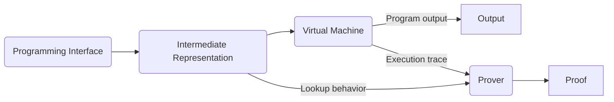

# Lookup-only IR
Lookup-centric dsl is substitution of any kind of IR, asm
## Simple structure for whole system
- Programming Interface (Front-end)
    - Languge what developers use (It can be any programming language)
- Intermediate (Middle-end)
    - Intermediate representation about lookup
    - It has logic gates, custom lookups
- Prover (Back-end)
    - We can choose several system for backend (i.e. Baloo, cq, ...), of course it could be halo2
    - cq
        - Aggregation can be done theoretically
        - Single proof for single statement (or just function) and then aggregate (TBD)
## Description
1. Developer writes program
2. Builder(inside system) constructs IR
3. Virtual machine executes IR
4. In the backend proving system, it recieves execution trace and lookup behavior.
5. Backend proves it and returns proof
## Flow

## IR syntax
```
%result = lookup i4 %x, %y ADD
```

For binary operations
```
(operation result) = lookup (type) (from1) (from2) (Table)
```
There can be several instructions to be done by lookup.
Each line is a combination of an operation and an assignment with single static assignment rule.

## Table
For this intermediate layer, there should be two types of table.
1. Fixed table
    - Instruction table
        - ADD, MUL, SUB, ...
        - All rows are made by all cases of operation
    - Program counter table
        - Not for all instructions
        - If pc meet jump, pc will be changed to `dest`
        - Store all jump behaviors

2. Dynamic table
    - Imitate memory behavior
    - If some operation uses assigned value, lookup it
    - Is it able?

## Structure
It will work as 8-bit architecture. If I can assure that table size for the other system that has more bits could work, it can be expanded.

### Binary operation instruction
For one instruction, it does two dynamic lookup operations to get operand values from memory table. And also it does one lookup operation to its own operation result table which is a fixed table. And then put the result to the memory table. This IR will use single static assignment form (SSA), so the dynamic table's value wouldn't be changed. We should assume that the size of memory table is infinite, though it isn't.

### Control flow & User-defined function
Phinode function will be used. User(circuit developer) can define any function, we can make new table for user-defined function. Program counter table will track jump instruction's destination.

## Questions
Let's assume 2-bit system.
| x | y | out |
| -------- | -------- | -------- |
| 00     | 00     | 000     |
|00|01|001|
|..|..|..|
|11|11|110|

For n-bit system, table size will be $2^{2n}$. If we make single bit logic gate and separate all instructions to bit operations, then the table size will be reduced but there will be more frequent lookup operations.

- Should we make any limit for the values' size?
    + for the number of function?
